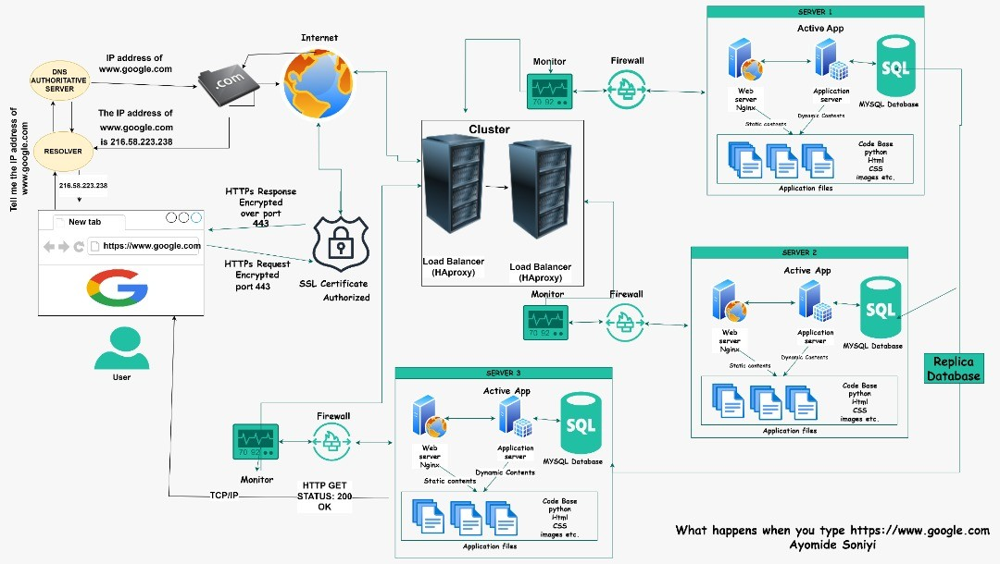
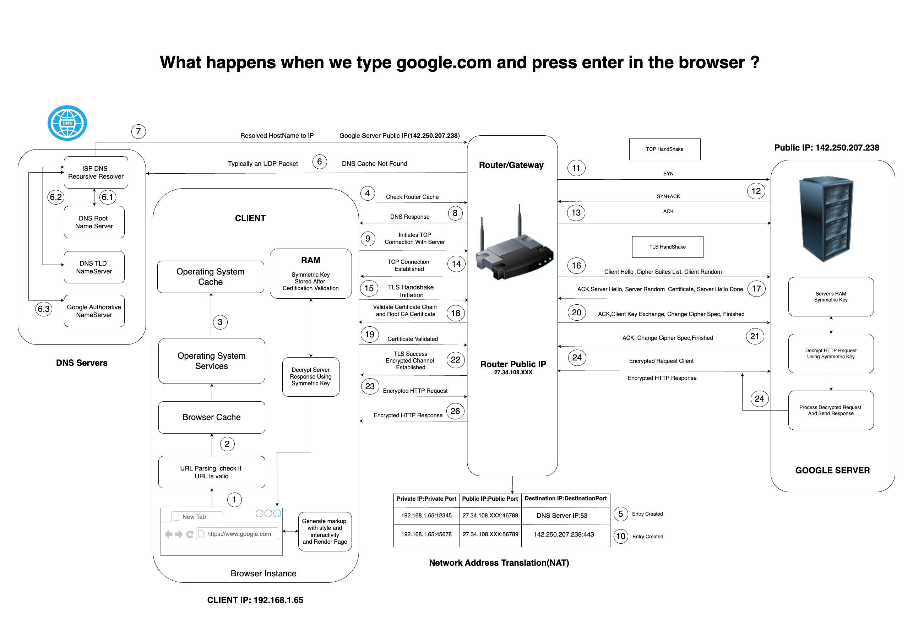

# Q) What happens when you type google.com on the browser and hit enter?

## When we type "google.com" into my web browser and press Enter, a complex series of events occurs to display the Google homepage.

Fig: process

---

## This process can be broken down into several key stages as follows:

### URL Parsing and Validation

-   **URL Parsing:** When you type "google.com" in the browser, the browser parses the URL to identify the domain name. This process involves breaking down the URL into its components, such as the protocol (HTTP or HTTPS), host (google.com), path, query parameters, etc.

-   **Validation:** The browser checks if the URL is correctly formatted and whether it's a valid URL. If the URL is invalid, the browser displays an error message.

### DNS Lookup to Find IP Address

**1. Browser Request:** Browser sends a DNS lookup request to the local DNS resolver.

**2. Local DNS Resolver:**

-   **Cache Check:** Checks its cache for the DNS record of ”google.com”.

    -   **Browser Cache:** The browser checks its local cache to see if it has a recent DNS record for google.com. DNS records include the IP address of the server associated with the domain. If found, it uses this cached record to avoid repeating the DNS lookup process.

    -   **Operating System Cache:** If the browser cache doesn’t contain the DNS record, the browser requests the DNS record from the operating system. The OS maintains a DNS cache to speed up the resolution process for recently accessed domains.

    -   **Router Cache:** If neither the browser nor the OS has the cached DNS record, the request is forwarded to the router. The router maintains its own DNS cache and may already have the necessary DNS record.

-   **NAT Table Entry Creation:** Network Address Translation (NAT): The router creates an entry in its NAT table, mapping the client’s internal private IP address and port (e.g., 192.168.1.65:12345) to a public IP address and port (e.g., 27.34.108.XX:46789). NAT allows multiple devices on a local network to share a single public IP address for internet access.

-   **Recursive Query:** If not cached, sends a recursive query to root DNS
    servers, then to TLD (Top-Level Domain) servers (.com), and finally to the
    authoritative DNS server for ”google.com”.

**3. Authoritative DNS Server:** Responds with the IP address of google.com.

**4. Response:** Local DNS resolver sends the IP address back to the browser. - ISP DNS server → router → operating system → browser.

### The Protocol Suite: TCP/IP

With the IP address at hand, Transmission Control Protocol/Internet Protocol (TCP/IP) - the protocol suite - kicks in. TCP establishes a reliable connection between your machine and Google's server, ensuring data integrity and order. IP, on the other hand, is responsible for routing the data packets to the correct destination.

### The Guard: Firewall

Before the packets venture further, they encounter the firewall - a security system ensuring that only safe and authorized traffic is allowed through. The firewall scrutinizes the packets based on predefined rules before permitting them onward.

### The Secure Passage: HTTPS/SSL

As we tread into a secure domain (https), Secure Socket Layer (SSL) or its successor Transport Layer Security (TLS) ensure a secure connection by encrypting the data transferred between your browser and Google's server, safeguarding against eavesdropping.

### The Distributor: Load Balancer

Arriving at Google's premises, a load balancer warmly welcomes the packets. Its job is to distribute incoming network traffic across several servers to ensure no single server becomes overwhelmed with too much traffic. This way, it ensures a seamless user experience.

### The Frontman: Web Server

Post load balancing, the web server takes the stage, handling the HTTP request. It decides what action is needed, often communicating with an application server to process the request further.

### The Processor: Application Server

The application server is the brain behind the operation, executing the necessary business logic, interacting with the database, and preparing the HTTP response to be sent back to your browser.

### The Storer: Database

To fulfill your request, the application server might need to fetch or store data. It interacts with the database, where data is stored, retrieved, and managed, ensuring that your search query is successfully executed.

### The Grand Finale: Rendering

The HTTP response makes its way back through the channels, reaching your browser which then renders the HTML, CSS, and JavaScript to display the webpage we all know and love as Google.

