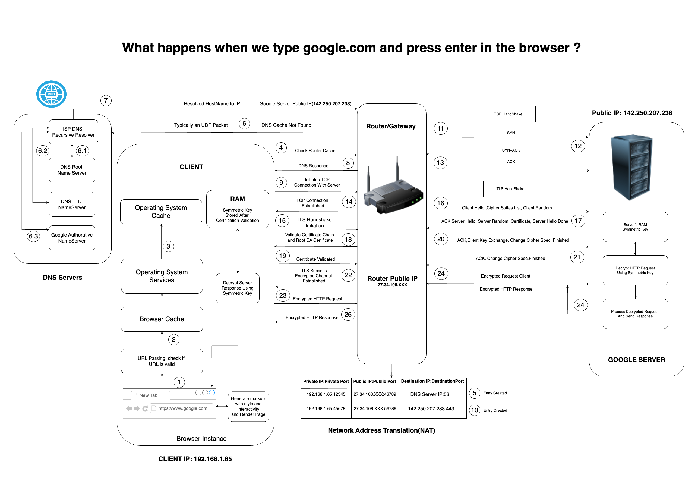

# Q) What happens when you type google.com on the browser and hit enter?

## When we type "google.com" into our web browser and press Enter, a complex series of events occurs to display the Google homepage.

Fig: process

---

## This process can be broken down into several key stages as follows:

## URL Parsing and Validation

-   **URL Parsing:** When you type "google.com" in the browser, the browser parses the URL to identify the domain name. This process involves breaking down the URL into its components, such as the protocol (HTTP or HTTPS), host (google.com), path, query parameters, etc.

-   **Validation:** The browser checks if the URL is correctly formatted and whether it's a valid URL. If the URL is invalid, the browser displays an error message.
      

## DNS Lookup to Find IP Address

**1. Browser Request:** Browser sends a DNS lookup request to the local DNS resolver.

**2. Local DNS Resolver:**

-   **Cache Check:** Checks its cache for the DNS record of ”google.com”.

    -   **Browser Cache:** The browser checks its local cache to see if it has a recent DNS record for google.com. DNS records include the IP address of the server associated with the domain. If found, it uses this cached record to avoid repeating the DNS lookup process.

    -   **Operating System Cache:** If the browser cache doesn’t contain the DNS record, the browser requests the DNS record from the operating system. The OS maintains a DNS cache to speed up the resolution process for recently accessed domains.

    -   **Router Cache:** If neither the browser nor the OS has the cached DNS record, the request is forwarded to the router. The router maintains its own DNS cache and may already have the necessary DNS record.

-   **NAT Table Entry Creation:** Network Address Translation (NAT): The router creates an entry in its NAT table, mapping the client’s internal private IP address and port (e.g., 192.168.1.65:12345) to a public IP address and port (e.g., 27.34.108.XX:46789). NAT allows multiple devices on a local network to share a single public IP address for internet access.

-   **Recursive Query:** If not cached, sends a recursive query to root DNS
    servers, then to TLD (Top-Level Domain) servers (.com), and finally to the
    authoritative DNS server for ”google.com”.

**3. Authoritative DNS Server:** Responds with the IP address of google.com.

**4. Response:** Local DNS resolver sends the IP address back to the browser. - ISP DNS server → router → operating system → browser.
  

## Establish TCP/IP Connection (Transport Layer)

Once the DNS lookup has resolved the domain name(google.com) to an IP address, browser needs to establish a connection with the server at that IP address to start exchanging data. This is done using the Transmission Control Protocol (TCP) over the Internet Protocol (IP), often referred to together as TCP/IP.

**1. Browser to Google Server:** Initiates a TCP (Transmission Control Protocol)
connection to the retrieved IP address of google.com.

**2. Three-Way Handshake:**

-   SYN (Synchronize): Browser sends a SYN packet to Google’s server.
-   SYN-ACK (Synchronize-Acknowledgment): Google’s server responds with
    SYN-ACK packet.
-   ACK (Acknowledgment): Browser sends an ACK packet, establishing the
    TCP connection.

Fig: 3 way TCP connection

When the browser initiates a TCP (Transmission Control Protocol) connection to the
IP address retrieved for ’google.com’, it follows a process known as the three-way
handshake. First, the browser sends a SYN (Synchronize) packet to Google’s server,
indicating its intention to establish a connection. Upon receiving the SYN packet,
Google’s server responds with a SYN-ACK (Synchronize-Acknowledgment) packet,
acknowledging the request and signaling its readiness to proceed with the connection. Finally, the browser sends an ACK (Acknowledgment) packet back to the server,
confirming the receipt of the SYN-ACK packet. This three-step process ensures that
both the browser and the server agree on establishing a reliable and orderly connection for transmitting data. It forms the foundation of TCP/IP communication, enabling
robust and error-checked data exchange between client and server in networked environments.

### The TCP Handshake Process

-   **SYN(Synchronize) Packet:**  
    Initiation: Our computer starts by sending a TCP packet with the SYN (synchronize)
    flag set. This packet includes a randomly generated sequence number, which will
    be used to keep the track of the data sent and received. The SYN packet is like
    your computer calling the server, signalling that it wants to establish a connection and
    synchronize sequence numbers.
-   **SYN - ACK (Synchronize - Acknowledgement) Packet:** 
    Response: The Google server, upon receiving the SYN packet, responds with a
    packet that has both the SYN and ACK (acknowledge) flags set. This packet acknowledges receipt of your SYN packet by including your sequence number plus one, and it
    also contains the server’s own sequence number. This SYN-ACK packet is the server
    answering your call and indicating it’s ready to communicate.
-   **ACK (Acknowledgement) Packet:** 
    Finalization: Our Computer responds to the SYN-ACK packet with an ACK packet,
    acknowledging the server’s sequence number by incrementing it by one.This ACK
    packet completes the handshake, confirming that both sides are ready to start data
    transmission.

### Post Handshake: Data Transmission

Once the TCP handshake is complete, a reliable connection is established between
the computer and the Google server. This connection is now ready for the exchange
of data, such as sending HTTP requests and receiving HTTP responses.

-   **Data Packets:** Data is sent in packets, each with a sequence number so that the recipient can reorder them if they arrive out of order. TCP ensures that all packets are received and can request retransmission if packets are lost.
-   **Acknowledgements:** As data packets are received, the recipient sends back acknowledgements to confirm receipt. This ensures reliable communication.

### Connection Termination

After the data exchange is complete, the connection is gracefully terminated using a
similar handshake process, involving FIN (finish) and ACK packets to ensure that both
sides agree to close the connection.

-   **FIN Packet:** One side (our computer) sends a FIN packet to indicate it wants
    to close the connection.
-   ACK Packet: The other side (the Google server) acknowledges the FIN
    packet.
-   **FIN Packet:** The server sends its own FIN packet.
-   **ACK Packet:** Your computer acknowledges the server’s FIN packet.

This ensures that connection is properly closed and all resources are released.
  

## HTTPS Secure Communication Begins (Transport and Application Layer)

**1. TLS Handshake:** If accessing via HTTPS (secure HTTP), browser and server
negotiate encryption parameters:

-   **Encryption Negotiation:**  Agree on encryption method and exchange encryption keys.
-   **Secure Channel:**  Establish a secure channel for encrypted data transmission.

Fig: TLS Handshake

During the TLS handshake for HTTPS, the browser and server agree on how to encrypt
data securely. They exchange encryption methods and keys, and then set up a secure
channel to protect all information exchanged between them. This ensures that data
sent between your browser and the website remains private and cannot be easily
intercepted or understood by unauthorized parties.
  

## Firewall Inspection (Network Layer)

**1. Firewall Check:** Request passes through any firewalls, which inspect and filter
traffic based on security policies. A firewall is a security system that regulates and monitors incoming and outgoing
network traffic based on predetermined security policies. Its primary objective is to safeguard a network from external threats, such as hackers and malware.
When you type a URL like “google.com” into your browser, the request that your
browser makes to Google’s server passes through the firewall en route. The firewall examines the incoming request to ensure that it is permitted based on its security policies.
There are two primary types of security policies that a firewall employs to examine incoming requests:

1. Policies that allow or prohibit traffic based on the origin and destination of the request. For example, a firewall may be programmed to block all traffic from specific countries or to allow only specific IP addresses to access the network.
2. Policies that allow or prohibit traffic based on the type of traffic. For example, a firewall may be programmed to block all traffic on certain ports (such as those used by malware) or to allow only certain types of traffic(such as HTTP or HTTPS)
     

## Load Balancer Distribution (Application and Transport Layer)

**1. Load Balancing:** If Google uses a load balancer, it distributes incoming requests
among multiple servers for efficient load management and scalability.

Being very popular site, Google gets billions of requests from users across the
globe every single day. A typical web server would crash under that kind of traffic
overload.To handle their enormous scale, Google deploys what’s known as a load
balancer. This is a reverse proxy that sits in front of the Google web servers and
distributes requests evenly across their server infrastructure.
The load balancer acts like a receptionist, taking incoming requests and forwarding
them to available servers for processing. Based on advanced algorithms, it selects an
optimal Google web server and routes your connection to that location.
This allows Google to efficiently spread the work across their network of servers.
The load balancer also improves redundancy and failover since requests can be shifted
from a downed server to a functioning one.
  

## Web Server Processes Request (Application Layer)

After load balancing, the web server takes the stage, handling the HTTP request. It decides what action is needed, often communicating with an application server to process the request further.

**1. Server Processing:** Web server at the IP address handles the request:

-   **Static Content:** Retrieves static resources (HTML, CSS, JavaScript, images) required to build the webpage.
-   **Dynamic Content:** May generate dynamic content based on user-specific
    data or interactions.
      

## Application Server Interaction (Application Layer)

The application server is the brain behind the operation, executing the necessary business logic, interacting with the database, and preparing the HTTP response to be sent back to your browser.

**1. Dynamic Processing:** For interactive or personalized content (e.g., search results):

-   **Application Server:** Executes server-side scripts (e.g., PHP, Python) to
    process requests and interact with databases.
-   **Database Queries:** Retrieves relevant data from databases (e.g., user preferences, search results).
      

## Web Server Sends Response (Application Layer)

**1. Response Preparation:** Constructs an HTTP response containing the fully rendered webpage.
**2. Optimization:** Compresses resources (e.g., minifies JavaScript, compresses
images) for efficient data transfer.
  

## Browser Receives and Renders Page (Application Layer)

**1. Page Rendering:** Browser receives the HTTP response:

-   **DOM Construction:** Parses HTML to create the Document Object Model
    (DOM) structure.
-   **CSS Application:** Applies CSS styles to the DOM for visual presentation.
-   **JavaScript Execution:** Executes JavaScript for interactivity and dynamic
    content updates.
-   **Rendering:** Displays the rendered webpage on the user’s screen.

Once Google gathers all the necessary data and resources through DNS lookups,
server requests, and security checks, it sends a complete webpage back to your
browser. This includes HTML for structure, CSS for styling, JavaScript for interactivity,
and media like images and videos. Your browser then builds the webpage, making
it interactive with features like search and animations. It adjusts the layout and style,
and finally displays everything on your screen. This process is secured with HTTPS
encryption for privacy and optimized for speed using techniques like minifying files and
using CDNs
  

## Cookies and Local Storage (Application Layer)

**1. Cookie Handling:** Stores cookies locally to track user sessions and preferences
across visits to google.com.

**2. Local Storage:** Caches static resources locally for faster load times during repeat visits.
  

 

## Conclusion

### In conclusion, the process of accessing ”google.com” involves a series of steps across various OSI model layers, ensuring secure, efficient, and personalized web browsing experience. From DNS lookup to rendering the webpage in the browser, each stage plays a crucial role in delivering content seamlessly to users. Understanding this process enhances our knowledge of internet technologies and infrastructure.
