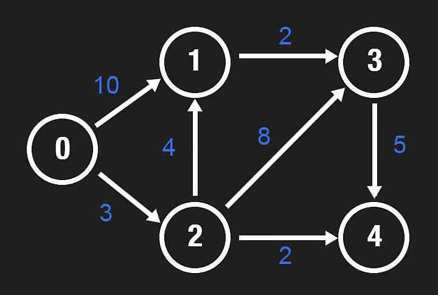

# Assignments:

1.  On leetcode find the problem that can be solved using dijkstra algorithm using programming language of your choice.

2.  Using Bellman Ford of first question

3.  For the first two question make a table that has every update for all the variables that you used.

## Leet Code Problem

Given a weighted, directed graph, and a starting vertex, return the shortest distance from the starting vertex to every vertex in the graph.

Input:

n - the number of vertices in the graph, where (2 <= n <= 100). Each vertex is labeled from 0 to n - 1.
edges - a list of tuples, each representing a directed edge in the form (u, v, w), where u is the source vertex, v is the destination vertex, and w is the weight of the edge, where (1 <= w <= 10).
src - the source vertex from which to start the algorithm, where (0 <= src < n).
Note: If a vertex is unreachable from the source vertex, the shortest path distance for the unreachable vertex should be -1.

Example 1:

Input:
n = 5
edges = [[0,1,10], [0,2,3], [1,3,2], [2,1,4], [2,3,8], [2,4,2], [3,4,5]]
src = 0

Output:
{{0:0}, {1:7}, {2:3}, {3:9}, {4:5}}
